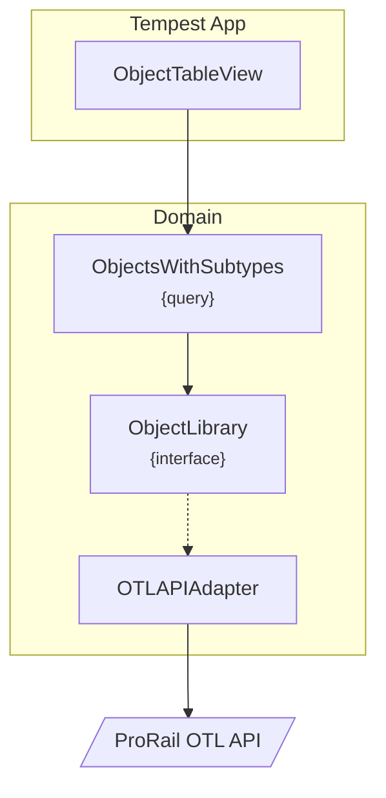
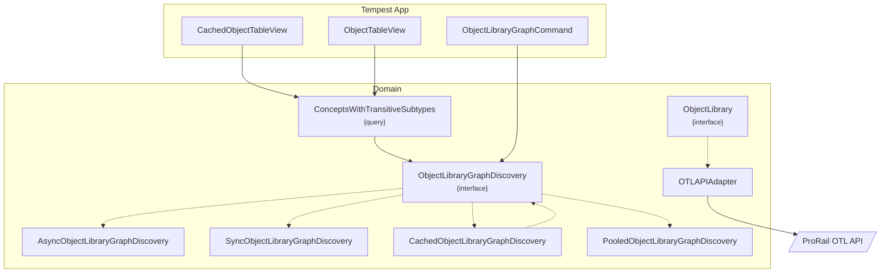

# ProRail OTL spoor

In deze repository staat de broncode van de opdracht gemaakt voor Moxio.

## Installatie

1. Installeer de benodigdheden met `composer`.

```shell
composer install
```

2. Start de ontwikkelserver.

```shell
php tempest serve
```

3. Op de interface in een browser.

```shell
open http://localhost:8000
```

### Tests

Draai de tests met PHPUnit:

```shell
composer phpunit
```

## Proces

De originele opdracht luidt:

> Schrijf een tooltje dat informatie uit de ProRail OTL spoor ophaalt via de beschreven API, en als output
een overzicht toont van alle concepten en het totaal aantal transitieve subtypen dat elk van deze
concepten heeft. Voor “Overweg” verwachten we dus te zien dat deze 4 transitieve subtypen heeft.

### Voorkennis

Uit mijn eerste gesprek met Moxio heb ik al wat informatie gekregen over de systemen waar Moxio aan werkt:

- Objectenregister
- OTL (Object Type Library)

Het Objectenregister is een systeem waar de klant (in dit geval ProRail) informatie over allerlei verschillende objecten kan beheren. Welke soort objecten geregistreerd kunnen worden, is beheerd in OTL.

Een parallel kan worden getrokken met winkel, waar het Objectenregister de inventaris is, en OTL de catalogus.

### Verkenning

Om het OTL systeem beter te leren kennen begon ik met een korte verkenning in de webinterface.

Uit de interface heb ik omgemaakt dat het systeem een boomstructuur bevat. Hieronder staat een deel van die boomstructuur rond het objecttype `Overweg`.

- Punt-Belegd-Baan-Installatie
  - Overweg
    - Actief-Beveiligde-Overweg
      - Half-Automatisch-Beveiligde-Overweg
    - Dienstoverpad
    - Niet-Actief-Beveiligde-Overweg

Een `Overweg` heeft dus een supertype van `Punt-Belegd-Baan-Installatie`, en drie directe subtypen van `Actief-Beveiligde-Overweg`, `Dienstoverpad` en `Niet-Actief-Beveiligde-Overweg`. Het subtype `Actief-Beveiligde-Overweg` heeft op zijn beurt weer een subtype van `Half-Automatisch-Beveiligde-Overweg`. Daarmee heeft het objecttype `Overweg` in totaal vier transitieve subtypen.

Daarnaast heeft elk objecttype ook een aantal kenmerken, maar deze kenmerken zijn niet relevant voor deze opdracht.

### Ontwerp

Het doel is om tot een ontwerp te komen dat later ook kan worden uitgebreid met nieuwe weergaves, en de mogelijkheid houden om de API als databron te vervangen met een andere.

Daarom lijkt dit een uitstekende kandidaat om _Hexagonal Architecture_, ofwel _Ports and Adapters_ toe te passen.



In het ontwerp implementeren we een `ObjectTableView` die de gegevens uit een `ObjectsWithSubtypes` query haalt.

Deze query class moet niet verward worden met een database query, maar is een referentie naar een query zoals beschreven in _Command Query Responsibility Segregation_. De taak van deze klasse is om de gegevens uit de `ObjectLibrary` te halen en in een gestructureerde vorm terug te geven.

De gegevens moeten uiteindelijk uit de OTL API worden gehaald, maar door dit netjes te scheiden met een adapter kunnen we ook een andere informatiebron gebruiken.

### Implementatie

Ik heb [Tempest](https://tempestphp.com) als framework gekozen om de app te bouwen. Het is een relatief nieuw type-strict framework dat ik een keer wilde uitproberen. Het doel was om de framework code zo veel mogelijk te scheiden van de domeincode, dus wilde ik geen Laravel gebruiken.

De implementatie volgt het ontwerp zo nauwkeurig mogelijk. Het enige verschil is dat ik uiteindelijk geen `ObjectWithSubtypes` klasse heb gemaakt, maar de gegevens direct uit de `ObjectLibrary` interface heb kunnen halen, zonder extra tussenlaag.

In `ObjectLibraryApiAdapater` gebruik in PHP 8.4 Lazy Objects om de API calls pas te doen als de gegevens daadwerkelijk aangeroepen worden.

### Reflectie

Transitieve subtypes bepalen vereist een API call per object. Dit wordt (te) traag als je alle objecten in een lijst wilt laten zien. De (kortzichtige) oplossing voor nu was om pagination toe te voegen zodat je niet te veel objecten in een keer laadt. Met de veronderstelling dat de gegevens in OTL relatief niet vaak veranderen, zou API caching of een kopie opslaan van de database een betere oplossing zijn.

Ik had niet eerder met Tempest gewerkt, waardoor ik wat meer tijd kwijt was met documentatie er van lezen. Daarnaast, mistte Tempest basisfunctionaliteiten zoals Pagination die mij beprekte in de tijd die beschikbaar had voor de domeincode.

### Reflectie 2.0

In mijn eerste implementatie _ging ik er van uit_ dat met behulp van de _Lazy Objects_ elk concept een keer zou worden opgehaald vanuit de API. Dit bleek niet te kloppen! De debugger liet zien dat zelfs voor de testcase van `Overweg`, de API meerdere keren werd aangeroepen per IRI. Deze bug heb ik er uit kunnen halen, maar dat gaf nog steeds niet de gewenste resultaten.

Ik heb nog een keer gekeken naar wat deze datastructuur nu conceptueel is, en dat lijkt het meest op een graaf, of preciser, een boom.

#### Grafen 

Om dat expliciet te maken, heb ik een `ObjectLibraryGraph` klasse toegevoegd die de graaf in zijn geheel representeert. Deze klasse heeft de functionaliteit gekregen om de transitieve subtypes te bepalen voor willekeurig object in de graaf.

Daarnaast heb ik de _Lazy Object_ implementatie weggehaald, en de verantwoordelijkheid van het opbouwen van de graaf verplaatst naar een `ObjectLibraryGraphDiscovery` interface. Dit maakt de klassen voor de API-adapter veel simpeler.

Het enige _complexe_ wat nu overblijft is de implementatie van de `ObjectLibraryGraphDiscovery` interface. Ik heb meerdere technieken geprobeerd om de implementatie zo effeicient en snel mogelijk te maken.

`SyncObjectLbiraryGraphDiscovery` en `AsyncObjectLibraryGraphDiscovery` zijn twee klassen die een _breadth-first search_ implementeren om de graaf op te bouwen.

De `SyncObjectLibraryGraphDiscovery` is de meest eenvoudige implementatie, maar deze is (zoals de originele implemetatie) niet geschikt voor grote hoeveelheden objecten. Het zou onmogelijk zijn om alle _concepten_ in te laden binnen de 30 seconden die beschikbaar is voor een _request_.

De `AsyncObjectLibraryGraphDiscovery` maakt gebruik van _Promises_ om de API calls asynchroon te doen, en is daarmee veel sneller. Hiermee kunnen we ongeveer ~25 requests tegelijkertijd doen. Hiermee is het mogelijk om zo'n 20 concepten op een pagina weer te geven met hun transitieve subtypes. Echter, dit is alsnog niet snel genoeg om **alle** concepten op een pagina te laten zien.

> Er werd nog gevraagd wat mij voor problematisch aspect er te vinden was in de opdracht.
> 
> Ik denk dat hiermee werd bedoeld dat een concept niet uitsluitend 1 of geen supertype heeft, maar dat meerdere supertypes mogelijk zijn. Dat betkent dus ook dat je bij het doorlopen van de boom naar beneden, je dezelfde subtypen tegen kan komen.
> 
> Dat is overgens ook te zien bij `Actief-Beveiligde-Overweg`. Deze heeft zowel `Overweg` als `Actief-Beveiligde-Overweg-Of-Waarschuwiungsinstallatie` als supertype.
>
> Bij mijn originele naïeve implementatie zou je bij het berekenen van de transitieve subtypen van zulke _meta-categorieën_ meerdere keren door hun subtypen gaan.

#### Caching

Daarom heb ik besloten om nog een derde `CachedObjectLibraryGraphDiscovery` toe te voegen. Deze klasse maakt gebruik van een cache door de graaf een keer op te bouwen en daarna een dag in opgeslagen te houden. Deze cache wordt gevuld door de `PooledObjectLibraryGraphDiscovery` welke met een pool van 30 workers de API calls doet.

Helaas is het nog niet mogelijk om de cache vanuit een _request_ te vullen, dat zou nog steeds te lang duren. Daarom heb ik een commando toegevoegd die de cache kan vullen. Deze kan gemakkelijk met `php tempest graph:warm` worden uitgevoerd. Daarna kan op `http://localhost:8000/cached` de gecachte versie van de graaf worden bekeken.

Een voordeel van deze implementatie is dat we nu ook gemakkelijk kunnen sorteren, en het concept met de meeste transitieve subtypen bovenaan kunnen weergeven.


