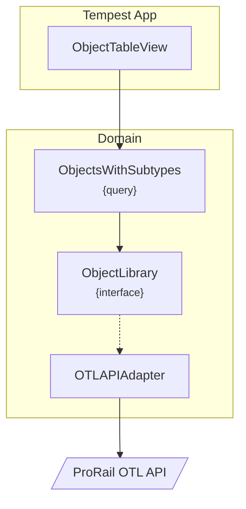

# ProRail OTL spoor

In deze repository staat de broncode van de opdracht gemaakt voor Moxio.

## Proces

De originele opdracht luidt:

> Schrijf een tooltje dat informatie uit de ProRail OTL spoor ophaalt via de beschreven API, en als output
een overzicht toont van alle concepten en het totaal aantal transitieve subtypen dat elk van deze
concepten heeft. Voor “Overweg” verwachten we dus te zien dat deze 4 transitieve subtypen heeft.

### Voorkennis

Uit mijn eerste gesprek met Moxio heb ik al wat informatie gekregen over de systemen waar Moxio aan werkt:

- Objectenregister
- OTL (Object Type Library)

Het Objectenregister is een systeem waar de klant (in dit geval ProRail) informatie over allerlei verschillende objecten kan beheren. Welke soort objecten geregistreerd kunnen worden, is beheerd in OTL.

Een parallel kan worden getrokken met winkel, waar het Objectenregister de inventaris is, en OTL de catalogus.

### Verkenning

Om het OTL systeem beter te leren kennen begon ik met een korte verkenning in de webinterface.

Uit de interface heb ik omgemaakt dat het systeem een boomstructuur bevat. Hieronder staat een deel van die boomstructuur rond het objecttype `Overweg`.

- Punt-Belegd-Baan-Installatie
  - Overweg
    - Actief-Beveiligde-Overweg
      - Half-Automatisch-Beveiligde-Overweg
    - Dienstoverpad
    - Niet-Actief-Beveiligde-Overweg

Een `Overweg` heeft dus een supertype van `Punt-Belegd-Baan-Installatie`, en drie directe subtypen van `Actief-Beveiligde-Overweg`, `Dienstoverpad` en `Niet-Actief-Beveiligde-Overweg`. Het subtype `Actief-Beveiligde-Overweg` heeft op zijn beurt weer een subtype van `Half-Automatisch-Beveiligde-Overweg`. Daarmee heeft het objecttype `Overweg` in totaal vier transitieve subtypen.

Daarnaast heeft elk objecttype ook een aantal kenmerken, maar deze kenmerken zijn niet relevant voor deze opdracht.

### Ontwerp

Het doel is om tot een ontwerp te komen dat later ook kan worden uitgebreid met nieuwe weergaves, en de mogelijkheid houden om de API als databron te vervangen met een andere.

Daarom lijkt dit een uitstekende kandidaat om _Hexagonal Architecture_, ofwel _Ports and Adapters_ toe te passen.

In het ontwerp implementeren we een `ObjectTableView` die de gegevens uit een `ObjectsWithSubtypes` query haalt.

Deze query class moet niet verward worden met een database query, maar is een referentie naar een query zoals beschreven in _Command Query Responsibility Segregation_. De taak van deze klasse is om de gegevens uit de `ObjectLibrary` te halen en in een gestructureerde vorm terug te geven.

De gegevens moeten uiteindelijk uit de OTL API worden gehaald, maar door dit netjes te scheiden met een adapter kunnen we ook een andere informatiebron gebruiken.

### Implementatie

Ik heb [Tempest](https://tempestphp.com) als framework gekozen om de app te bouwen. Het is een relatief nieuw type-strict framework dat ik een keer wilde uitproberen. Het doel was om de framework code zo veel mogelijk te scheiden van de domeincode, dus wilde ik geen Laravel gebruiken.

De implementatie volgt het ontwerp zo nauwkeurig mogelijk. Het enige verschil is dat ik uiteindelijk geen `ObjectWithSubtypes` klasse heb gemaakt, maar de gegevens direct uit de `ObjectLibrary` interface heb kunnen halen, zonder extra tussenlaag.

In `ObjectLibraryApiAdapater` gebruik in PHP 8.4 Lazy Objects om de API calls pas te doen als de gegevens daadwerkelijk aangeroepen worden.

### Reflectie

Transitieve subtypes bepalen vereist een API call per object. Dit wordt (te) traag als je alle objecten in een lijst wilt laten zien. De (kortzichtige) oplossing voor nu was om pagination toe te voegen zodat je niet te veel objecten in een keer laadt. Met de veronderstelling dat de gegevens in OTL relatief niet vaak veranderen, zou API caching of een kopie opslaan van de database een betere oplossing zijn.

Ik had niet eerder met Tempest gewerkt, waardoor ik wat meer tijd kwijt was met documentatie er van lezen. Daarnaast, mistte Tempest basisfunctionaliteiten zoals Pagination die mij beprekte in de tijd die beschikbaar had voor de domeincode.